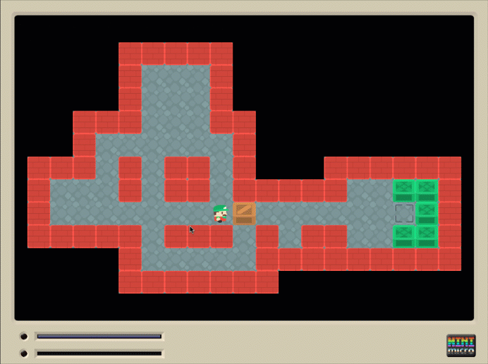

# Mini Micro Demos

These are some demo programs I coded for the [Mini Micro](https://miniscript.org/MiniMicro/index.html) virtual computer, done for education purposes but mostly for fun.

For now they are categorized as:

* Games
* Conceptual

The "conceptual" category tries to illustrate MiniScript / Mini Micro concepts via short programs that focus on only one thing.

Hope you enjoy them and find them useful in learning about the fascinating world of the Mini Micro!
