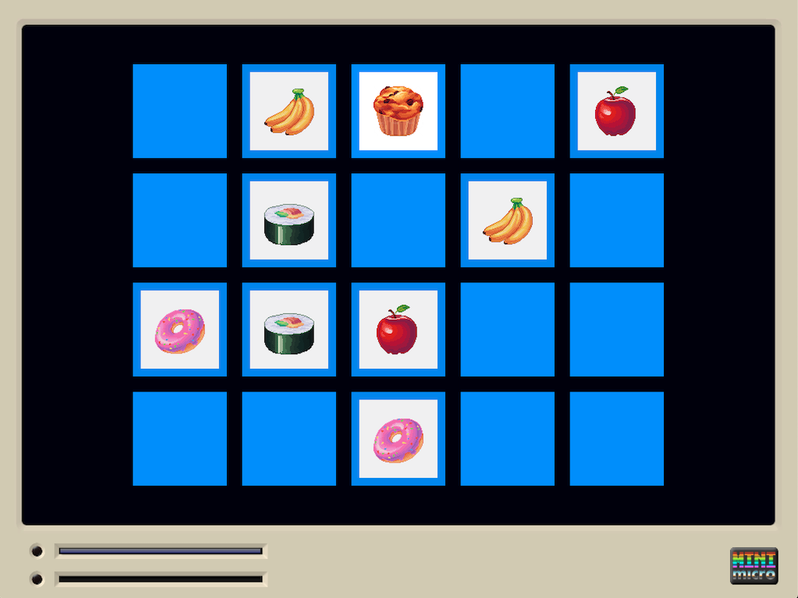

# Memory Game for the Mini Micro

This is a simple memory game, using built-in assets.

This version of the game is for one player only, as a solitaire game.

## Gameplay

You uncover cards by clicking on them, one pair at a time.

Discovered "paired" cards remain visible. The game ends when all pairs are uncovered.

To quit you can press the "Q" key or ESC on your keyboard.
